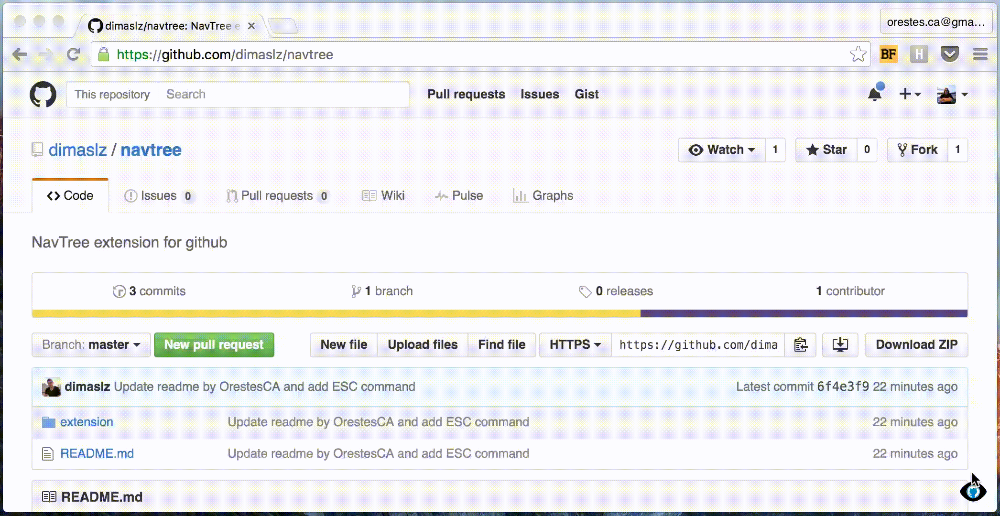

#NavTree for Github
Displays the repo structure and file contents quickly.
This extension is saves you time when you want to take a peek at the repo code and you don't want to navigate back and forth between directories in the GitHub interface and losing the context of the code. 

## Setup 
* Clone this and load the unpacked extension into Chrome or [install through the Chrome Web Store](http://google.com)

## How to use
* Install the extension
* Navigate to a GitHub repo.
* Click the new icon in the bottom-right corner or use the `CTRL+E` keyboard shortcut.
* NavTree pops up
* To close the overlay 
* To exit, click on the icon again.

## Caveats
* This a quick n' dirty proof of concept. The extension is using the free GitHub API quota. If you make heavy use of it, it may get blocked for a day. I'll add GitHub authentication sometime in the future to prevent this.
* The code is nothing to be proud of, I just wanted to get this out there and see if anybody else finds this extension useful. 

## TODO
* Add Github API integration.
* Try to implement it for Bitbucket too.
* Improve code.
* Add file type icons on the tree view.
* Center images.
* Open multiple files in different tabs.
* Improve icon.

## Colaboration
This project is open source, so please, feel free to send in pull request or file issues with feature requests, I will try to implement them and give you proper credit.

## Acknowledgements
* Syntax highlighting done with [https://highlightjs.org](https://highlightjs.org)

## License

The MIT License (MIT)

Copyright (c) 2016 Dimas López <me@dimaslz.io>
[@dimaslz](http://twitter.com/dimaslz) [http://dimaslz.io](http://dimaslz.io) · [http://dimaslz.com](http://dimaslz.com)

Permission is hereby granted, free of charge, to any person obtaining a copy
of this software and associated documentation files (the "Software"), to deal
in the Software without restriction, including without limitation the rights
to use, copy, modify, merge, publish, distribute, sublicense, and/or sell
copies of the Software, and to permit persons to whom the Software is
furnished to do so, subject to the following conditions:

The above copyright notice and this permission notice shall be included in
all copies or substantial portions of the Software.

THE SOFTWARE IS PROVIDED "AS IS", WITHOUT WARRANTY OF ANY KIND, EXPRESS OR
IMPLIED, INCLUDING BUT NOT LIMITED TO THE WARRANTIES OF MERCHANTABILITY,
FITNESS FOR A PARTICULAR PURPOSE AND NONINFRINGEMENT. IN NO EVENT SHALL THE
AUTHORS OR COPYRIGHT HOLDERS BE LIABLE FOR ANY CLAIM, DAMAGES OR OTHER
LIABILITY, WHETHER IN AN ACTION OF CONTRACT, TORT OR OTHERWISE, ARISING FROM,
OUT OF OR IN CONNECTION WITH THE SOFTWARE OR THE USE OR OTHER DEALINGS IN
THE SOFTWARE.
